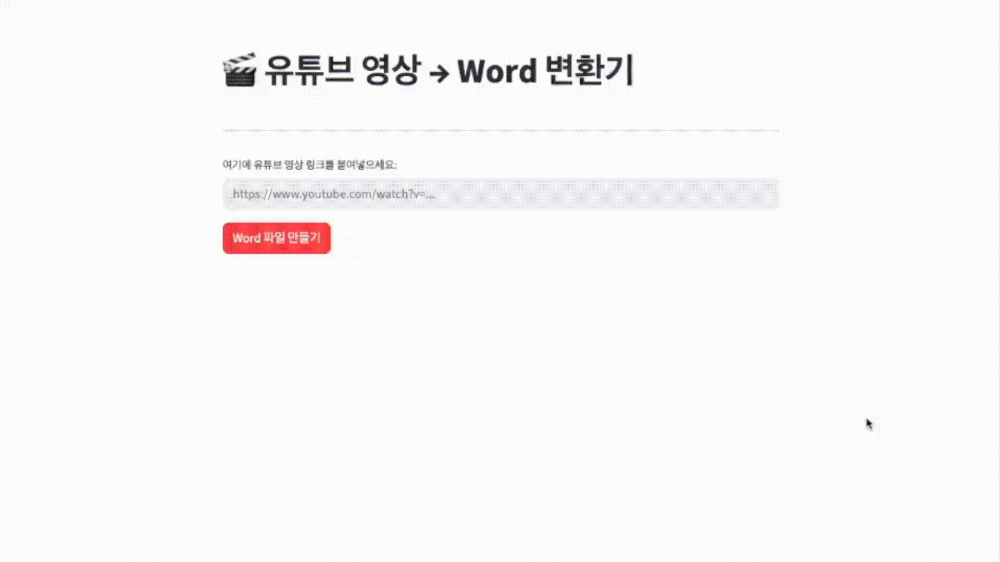

# YouTube 영상 → Word 변환기

## 소개



유튜브 영상의 제목, 스크립트, 번역본을 자동으로 추출하여 Word 파일로 생성하는 도구입니다.  
중국 뉴스를 보면서 중국어를 공부하시는 아버지를 위하여 제작하였습니다.  

기존에는 다음과 같은 순서로 작업이 진행되었습니다.
1. 워드 파일 생성
2. 유튜브 동영상의 제목을 드래그하여 워드 파일에 붙여넣기
3. Google AI Studio에서 유튜브 링크를 입력하여 스크립트 추출하고 답변을 복사하여 워드 파일에 붙여넣기
4. Gemini를 통해 스크립트를 번역하고 답변을 복사하여 워드 파일에 붙여넣기

이를 영상의 링크만 입력하면 모든 과정을 자동으로 진행하도록 최적화하였습니다.

**프롬프트가 중국어에 최적화되어 있으므로, 다른 언어에는 적합하지 않습니다.**

## 기능

- 🎬 유튜브 영상 제목 자동 추출
- 📝 영상 스크립트 자동 추출
- 🌐 스크립트 한국어 번역
- 📄 모든 내용을 하나의 Word 파일로 생성

## 로컬 환경에서 이용 방법

### 1. 저장소 클론

```bash
git clone https://github.com/fredjeong/chinese-study-helper.git
cd chinese-study-helper
```

### 2. 가상환경 생성 및 활성화

```bash
python -m venv venv
source venv/bin/activate  # macOS/Linux
source venv/Scripts/activate  # Windows
```

### 3. 의존성 설치

```bash
pip install -r requirements.txt
```

### 4. 환경 변수 설정
`.env` 파일을 생성하고 다음 내용을 추가하세요:

```env
GEMINI_API_KEY=your_gemini_api_key_here
YOUTUBE_API_KEY=your_youtube_api_key_here
```

### 5. `docx_creator.py` 파일에서 가이드를 따라 주석 처리 및 해제

## API 키 발급 방법

**Gemini API 키:**
1. [Google AI Studio](https://aistudio.google.com/app/apikey)에 접속
2. API 키 생성
3. 생성된 키를 `GEMINI_API_KEY`에 설정

**YouTube API 키:**
1. [Google Cloud Console](https://console.cloud.google.com/)에 접속
2. YouTube Data API v3 검색
3. API 키 생성
4. 생성된 키를 `YOUTUBE_API_KEY`에 설정

## 사용 방법

### 기본 사용법

```bash
python main.py
```

프로그램을 실행하면:
1. 유튜브 링크 입력 프롬프트가 나타납니다.
2. 영상의 링크를 입력해주세요.

### 지원하는 URL 형식
- `https://youtu.be/VIDEO_ID`
- `https://www.youtube.com/watch?v=VIDEO_ID`

### 출력 파일
- 파일명: `YYYYMMDD_[영상 제목].pdf`
- 위치: 현재 작업 디렉토리

## 프로젝트 구조

```
chinese-study-helper/
├── .devcontainer          # 개발 환경 설정
├── examples               # 예시 결과물 파일
├── figures                # 그림 파일
├── .env                   # 환경 변수 (사용자 생성)
├── .gitignore             # 버전 관리에서 제외할 파일
├── docx_creator.py        # Word 파일 생성 모듈
├── main.py                # 메인 프로그램
├── README.md              # 이 파일
├── requirements.txt       # 의존성 목록
├── streamlit_app.py       # Streamlit 앱
├── title_extractor.py     # 제목 추출 모듈
├── transcriber.py         # 스크립트 추출 모듈
└── translator.py          # 번역 모듈
```

## 주의사항

- Gemini API와 YouTube API의 사용량 제한이 있을 수 있습니다
- 긴 영상의 경우 스크립트 추출에 시간이 오래 걸릴 수 있습니다
- API 키는 안전하게 보관하고 공개하지 마세요
- `.env` 파일은 `.gitignore`에 추가하여 버전 관리에서 제외하세요

## 문제 해결

### API 키 오류
- `.env` 파일이 올바른 위치에 있는지 확인
- API 키가 정확히 입력되었는지 확인
- API 키의 권한이 올바르게 설정되었는지 확인

### 스크립트 추출 실패
- 영상이 공개되어 있는지 확인
- 영상에 음성이 포함되어 있는지 확인
- Gemini API 할당량을 확인

### 번역 실패
- 입력 텍스트가 올바른 형식인지 확인
- Gemini API 할당량을 확인

## 라이선스

이 프로젝트는 MIT 라이선스 하에 배포됩니다.
